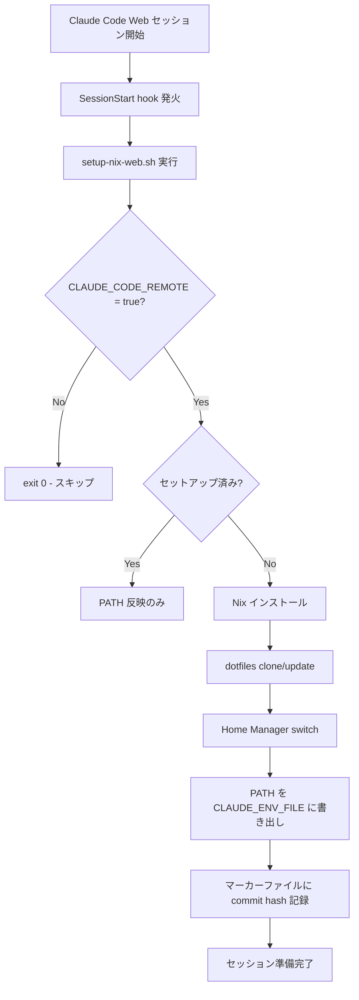

# Nix + Home Manager で Claude Code Web の開発環境を自動構築する

## はじめに

[Claude Code](https://claude.ai/code) には Web 版があり、ブラウザ上でそのまま開発できます。しかし Claude Code Web のセッションはエフェメラルな Linux コンテナ上で動作するため、セッションが終わるたびに環境はリセットされます。

普段 macOS で Nix + Home Manager を使って dotfiles を管理している場合、「Claude Code Web でも同じ環境を使いたい」と思うのは自然なことです。

本記事では、Claude Code の **SessionStart hook** を使って Nix のインストールから Home Manager による dotfiles 適用までを自動化し、セッション開始時に開発環境を自動構築する方法を紹介します。

## 課題と解決策

### Claude Code Web の制約

- セッションごとに環境がリセットされる（エフェメラル）
- root ユーザーで実行される Linux 環境
- Nix はプリインストールされていない
- `CLAUDE_ENV_FILE` 経由でないと、セッション中の PATH が引き継がれない

### 解決策

Claude Code の SessionStart hook でシェルスクリプトを実行し、以下を自動化します:

1. Nix をシングルユーザーモードでインストール
2. dotfiles リポジトリを clone
3. Home Manager で設定を適用
4. `CLAUDE_ENV_FILE` 経由で PATH を Claude Code セッションに引き継ぐ

## 全体アーキテクチャ



### リポジトリ構成

```
dotfiles/
├── flake.nix              # Flake エントリポイント（macOS/Linux 両対応）
├── home.nix               # Home Manager メイン設定
├── modules/
│   ├── packages.nix       # CLI ツール（ripgrep, fd 等）
│   ├── shell.nix          # Zsh + Oh My Zsh + エイリアス
│   ├── git.nix            # Git 設定
│   └── agent-skills.nix   # Claude Code スキル・設定のデプロイ
├── setup-nix-web.sh       # Claude Code Web 用ブートストラップ
└── .claude/
    └── settings.json      # SessionStart hook 定義
```

## 実装解説

### 1. SessionStart hook の設定

`.claude/settings.json` にリポジトリレベルの hook を設定します。このファイルはリポジトリに含めて管理します。

```json
{
  "hooks": {
    "SessionStart": [
      {
        "hooks": [
          {
            "type": "command",
            "command": "./setup-nix-web.sh",
            "timeout": 300
          }
        ]
      }
    ]
  }
}
```

**ポイント**:
- `timeout: 300`（5分）: Nix のインストールと Home Manager の初回実行には時間がかかるため、十分なタイムアウトを設定します
- `command` の CWD はプロジェクトルートです

### 2. セットアップスクリプト（setup-nix-web.sh）

スクリプトの設計上のポイントは3つです:
- **CLAUDE_CODE_REMOTE によるガード**: Claude Code Web 環境でのみ実行
- **冪等性**: マーカーファイルにより、同じコミットに対して二度セットアップしない
- **CLAUDE_ENV_FILE による PATH 引き継ぎ**: Claude Code セッション内の Bash ツールで Nix パッケージを使えるようにする

#### ガード条件

```bash
# Only run in Claude Code Web (macOS users use `hms` directly)
if [ "${CLAUDE_CODE_REMOTE:-}" != "true" ]; then
  exit 0
fi
```

`CLAUDE_CODE_REMOTE` は Claude Code Web 環境でのみ `true` にセットされる環境変数です。これにより、ローカルの macOS や WSL 上の Linux での誤発火を防ぎます。

#### 冪等性チェック

```bash
MARKER_FILE="$HOME/.local/state/nix-web-setup-done"

if [ -d "$DOTFILES_DIR" ]; then
  current_ref="$(git -C "$DOTFILES_DIR" rev-parse HEAD 2>/dev/null || echo "")"
  if [ -f "$MARKER_FILE" ] && [ -n "$current_ref" ] && \
     [ "$(cat "$MARKER_FILE")" = "$current_ref" ]; then
    log "Already set up for commit $current_ref — skipping"
    source_nix_env
    export_env
    exit 0
  fi
fi
```

マーカーファイルに前回セットアップ時の git commit hash を記録し、同じコミットなら再セットアップをスキップします。ただし `source_nix_env` と `export_env` は毎回実行して PATH を引き継ぎます。

#### Nix インストール

```bash
if ! command -v nix >/dev/null 2>&1; then
  # Method A: Determinate Systems installer（推奨）
  curl --proto '=https' --tlsv1.2 -sSfL \
    https://install.determinate.systems/nix \
    -o "$TMP_INSTALLER"
  sh "$TMP_INSTALLER" install linux --init none --no-confirm --diagnostic-endpoint ""

  # Method B: 公式 tarball（フォールバック）
  # Determinate Systems installer が失敗した場合に使用
  NIX_VERSION="2.28.3"
  TARBALL_URL="https://releases.nixos.org/nix/nix-${NIX_VERSION}/..."
  # ... (single-user mode でインストール)
fi
```

2段階のフォールバック構成です:
- **Method A**: [Determinate Systems installer](https://github.com/DeterminateSystems/nix-installer) — Flakes がデフォルトで有効
- **Method B**: nixos.org 公式 tarball — `--no-daemon`（シングルユーザーモード）+ experimental features 手動設定

Claude Code Web は root で実行されるため、シングルユーザーモード（`--no-daemon`）で問題ありません。

#### Home Manager switch

```bash
export NIX_SYSTEM="$NIX_SYSTEM_VALUE"
export USER="${USER:-$(whoami)}"

nix run --impure "github:nix-community/home-manager/release-25.11" \
  -- switch --impure --flake "$DOTFILES_DIR#default" -b backup
```

`--impure` フラグにより `NIX_SYSTEM` と `USER` の環境変数が Nix 式の中から参照可能になります（後述）。

#### PATH の引き継ぎ

```bash
export_env() {
  if [ -n "${CLAUDE_ENV_FILE:-}" ]; then
    {
      echo "export PATH=\"$HOME/.nix-profile/bin:/nix/var/nix/profiles/default/bin:\$PATH\""
      echo "export NIX_SYSTEM=$NIX_SYSTEM_VALUE"
    } >> "$CLAUDE_ENV_FILE"
  fi
}
```

`CLAUDE_ENV_FILE` は Claude Code が用意する特殊なファイルで、ここに `export` 文を追記すると、以降の Bash ツール実行時にその環境変数が引き継がれます。これがないと、hook で Nix をインストールしても Claude Code のセッション内で `nix` や `fd` コマンドが見つかりません。

### 3. Flake のプラットフォーム対応（flake.nix）

```nix
{
  inputs = {
    nixpkgs.url = "github:nixos/nixpkgs/nixos-unstable";
    home-manager = {
      url = "github:nix-community/home-manager";
      inputs.nixpkgs.follows = "nixpkgs";
    };
  };

  outputs = inputs@{ self, nixpkgs, home-manager, ... }:
    let
      # --impure で実行時のシステムを検出（デフォルトは aarch64-darwin）
      system = builtins.getEnv "NIX_SYSTEM"
        |> (s: if s == "" then "aarch64-darwin" else s);
      pkgs = nixpkgs.legacyPackages.${system};

      mkHome = home-manager.lib.homeManagerConfiguration {
        inherit pkgs;
        extraSpecialArgs = {
          inherit inputs;
          username = builtins.getEnv "USER";
        };
        modules = [ ./home.nix ];
      };
    in {
      homeConfigurations."default" = mkHome;
    };
}
```

**ポイント**:
- `NIX_SYSTEM` 環境変数でプラットフォームを検出。未設定時は `aarch64-darwin`（macOS Apple Silicon）をデフォルトにします
- `builtins.getEnv "USER"` でユーザー名を動的解決。macOS では自分のユーザー名、Claude Code Web では `root` になります
- `--impure` フラグが必要です（`builtins.getEnv` は pure evaluation では使えない）

### 4. Home Manager 設定（home.nix）

```nix
{ config, pkgs, username, ... }:

{
  imports = [
    ./modules/packages.nix
    ./modules/shell.nix
    ./modules/git.nix
  ];

  home.username = username;
  home.homeDirectory =
    if pkgs.stdenv.isDarwin then "/Users/${username}"
    else if username == "root" then "/root"
    else "/home/${username}";

  home.stateVersion = "25.11";
  programs.home-manager.enable = true;
}
```

`pkgs.stdenv.isDarwin` で macOS/Linux を判定し、適切なホームディレクトリを設定します。Claude Code Web では root 実行なので `/root` になります。

## セットアップ手順（読者向け）

既に Nix Flakes + Home Manager で dotfiles を管理している前提で、Claude Code Web 対応を追加する手順です。

### Step 1: flake.nix にプラットフォーム対応を追加

`system` の決定ロジックに `NIX_SYSTEM` 環境変数によるオーバーライドを追加します:

```nix
system = builtins.getEnv "NIX_SYSTEM"
  |> (s: if s == "" then "aarch64-darwin" else s);  # デフォルトを自分の環境に合わせる
```

### Step 2: home.nix に Linux 対応の homeDirectory 分岐を追加

```nix
home.homeDirectory =
  if pkgs.stdenv.isDarwin then "/Users/${username}"
  else if username == "root" then "/root"
  else "/home/${username}";
```

### Step 3: setup-nix-web.sh を作成

本記事の実装を参考に、以下の機能を含むスクリプトを作成します:

- `CLAUDE_CODE_REMOTE` によるガード
- 冪等性チェック（マーカーファイル）
- Nix インストール（Determinate Systems → 公式 tarball フォールバック）
- dotfiles clone → Home Manager switch
- `CLAUDE_ENV_FILE` への PATH 書き出し

```bash
chmod +x setup-nix-web.sh
```

### Step 4: .claude/settings.json に SessionStart hook を設定

```json
{
  "hooks": {
    "SessionStart": [
      {
        "hooks": [
          {
            "type": "command",
            "command": "./setup-nix-web.sh",
            "timeout": 300
          }
        ]
      }
    ]
  }
}
```

### Step 5: push して Claude Code Web で確認

```bash
git add setup-nix-web.sh .claude/settings.json
git commit -m "feat: add Claude Code Web auto-setup via SessionStart hook"
git push
```

Claude Code Web で対象リポジトリを開くと、セッション開始時に自動でセットアップが実行されます。

## 動作検証

実際に Claude Code Web で新しいセッションを開いて検証した結果です。

### セットアップログ

```
[setup-nix-web] Starting Nix environment setup for Claude Code Web
[setup-nix-web] Installing Nix (single-user mode)...
[setup-nix-web] Downloading Nix 2.28.3 from nixos.org...
...
[setup-nix-web] Home Manager switch completed
[setup-nix-web] Setup complete in 69s (commit: 1cde846a...)
```

約 **69秒** で Nix インストールから Home Manager 適用まで完了しました。

### 確認結果

| # | 確認項目 | 結果 | 詳細 |
|---|---------|------|------|
| 1 | ガード条件 | OK | `if [ "${CLAUDE_CODE_REMOTE:-}" != "true" ]; then` が正しく設定されている |
| 2 | 環境変数 | OK | `CLAUDE_CODE_REMOTE=true` がセットされている |
| 3 | hook 自動実行 | OK | コミット `1cde846a` で 69秒でセットアップ完了 |
| 4 | PATH 引き継ぎ | OK | `nix 2.28.3`、`fd`・`rg` ともに `/root/.nix-profile/bin/` に配置 |
| 5 | 冪等性マーカー | OK | `1cde846a...` が `~/.local/state/nix-web-setup-done` に記録済み |

### 冪等性の確認

同一セッション内で再度セッションが開始された場合（resume）、マーカーファイルの commit hash が一致するため再セットアップはスキップされ、PATH の再エクスポートのみ行われます。

## Tips / 注意点

### CLAUDE_CODE_REMOTE 環境変数

Claude Code Web 環境では `CLAUDE_CODE_REMOTE=true` が自動的にセットされます。これを使うことで、`uname` による OS 判定よりも正確に Claude Code Web 環境を識別できます。WSL や通常の Linux マシンでの誤発火も防げます。

### timeout の設定

初回セットアップでは Nix のダウンロード・インストールと nixpkgs の fetch が発生するため、十分なタイムアウトが必要です。実測で約69秒でしたが、ネットワーク状況により変動するため **300秒（5分）** を推奨します。

### nixpkgs channel の 403 警告

セットアップ中に nixpkgs channel 関連の 403 警告が出ることがありますが、Flake ベースの構成では channel を使わないため実害はありません。

### シングルユーザーモード

Claude Code Web は root ユーザーで実行されるため、Nix のマルチユーザーモード（daemon）は不要です。`--no-daemon`（シングルユーザーモード）でインストールすることで、systemd 等への依存を回避できます。

### CLAUDE_ENV_FILE の仕組み

Claude Code は `CLAUDE_ENV_FILE` 環境変数にファイルパスをセットしています。hook スクリプトからこのファイルに `export PATH=...` を追記すると、以降の Bash ツール実行時にその環境変数が有効になります。これが Nix でインストールしたツールを Claude Code セッション内で使えるようにする鍵です。

## まとめ

Nix + Home Manager で管理している dotfiles を Claude Code Web でも自動的に適用する方法を紹介しました。

SessionStart hook → `CLAUDE_CODE_REMOTE` ガード → Nix インストール → Home Manager switch → `CLAUDE_ENV_FILE` による PATH 引き継ぎ、という流れで、約69秒でいつもの開発環境が Claude Code Web 上に再現されます。

冪等性の設計により、2回目以降のセッション開始は即座にスキップされるため、日常的な使用でも快適です。

Nix で環境を宣言的に管理している方は、ぜひ Claude Code Web でもその恩恵を活用してみてください。
